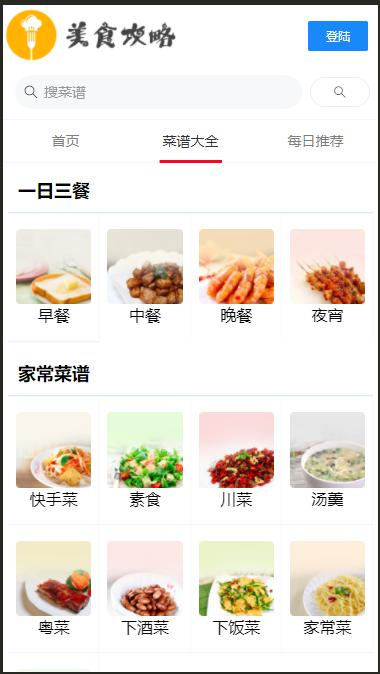

# cook
## 效果图




## 技术栈
```
vue-cli3.x
vant ui
mockjs //模拟后端数据
axios 
```
## Project Install
```
git clone https://github.com/WuAlin0327/cook.git
```

## Project setup
```
cd cook
npm install
```

### Compiles and hot-reloads for development
```
npm run serve
```

### Compiles and minifies for production
```
npm run build
```

### Run your tests
```
npm run test
```

### Lints and fixes files
```
npm run lint
```

### Customize configuration
See [Configuration Reference](https://cli.vuejs.org/config/).
